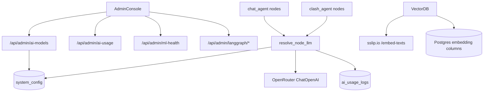

# Admin monitoring, per-node models, and Pinecone removal

## Scope (chosen default)
Port the **AI-relevant** reference admin surface — not SunoDelhi domain tabs (taxonomy, departments, officers, Redis/queues, crisis, intake, sentiment).

| Keep / add | Skip |
|---|---|
| Overview + AI usage charts + embedding/ML health | Taxonomy, departments, officers |
| AI & models (per graph-node pickers + embedding URL) | Routing/SLA, crisis, filing limits |
| LangGraph agent monitoring (enhance existing tester) | Queues & Redis, embedded cases |
| Audit tab (UI over existing `admin_audit_logs`) | Intake / sentiment analysis tabs |
| Existing Tables / SQL / Reset codes | |

Reference source of truth (gitignored): [`reference/components/admin/`](reference/components/admin/), [`reference/backend/services/adminModels.ts`](reference/backend/services/adminModels.ts), [`reference/backend/services/aiUsage.ts`](reference/backend/services/aiUsage.ts).

## 1. Schema: config, usage, vectors

Add migration [`backend/database/migrations/009_ai_models_and_pgvector.sql`](backend/database/migrations/009_ai_models_and_pgvector.sql):

- `system_config (key text PK, value jsonb, updated_at)` — same pattern as reference
- `ai_usage_logs (id, task, model, provider, prompt_tokens, completion_tokens, total_tokens, created_at)` + indexes on `created_at`, `task`, `model`
- Seed defaults:
  - `graph_node_models`: every `chat_agent` / `clash_agent` node → `{provider:"openrouter", model:"nvidia/nemotron-3-ultra-550b-a55b:free"}`
  - `ai_embeddings`: `{provider:"nyaysahayak", model:"krutrim-ai-labs/Vyakyarth", external_embedding_url:"https://130-211-122-175.sslip.io"}`
  - `sql_generation`: same OpenRouter default (for future NL→SQL)
- Align vectors to **768-d** (API dim):
  - Alter `mock_scams.embedding` from `vector(760)` → `vector(768)` (reindex HNSW)
  - Add `lawyers.embedding vector(768)` + HNSW
  - Add `scam_reports` table (or reuse `mock_scams`) with `embedding vector(768)` for city scam alerts currently stored in Pinecone namespace `scams`
  - SQL helpers: `match_lawyers(...)`, `match_scam_reports(...)` mirroring `match_legal_documents`

## 2. Backend: model registry + LLM resolution

New modules (Python ports of reference):

- [`backend/services/admin_models.py`](backend/services/admin_models.py) — catalog, read/patch `system_config`, resolve per-node models; OpenRouter catalog includes `nvidia/nemotron-3-ultra-550b-a55b:free` as **default**; Gemini list retained as alternate provider
- [`backend/services/ai_usage.py`](backend/services/ai_usage.py) — `log_ai_usage`, `get_ai_usage_analytics` (same aggregates as reference charts)
- Rewrite [`backend/utils.py`](backend/utils.py) `LLMFallbackWrapper` → **config-aware** `get_llm_for_task(task_id)`:
  - Primary: OpenRouter `ChatOpenAI` with resolved model (default nemotron free)
  - Fallback chain: remaining OpenRouter catalog entry → existing Gemini models if keys present
  - Log each invoke into `ai_usage_logs` with `task=<graph_node>`
- Update [`backend/agents/clash/llm.py`](backend/agents/clash/llm.py) to resolve via `get_llm_for_task("clash_agent.<node>")` instead of hardcoded `openrouter/owl-alpha`
- Thin adapter so agents keep `llm.invoke(...)` but bind a **task id** per agent/node:
  - Chat nodes: `supervisor`, `cyber`, `civil`, `domestic`, `scam`, `document`, `sahayak`, `legal_moderator`, `lawyer_forwarder`, `question_processor`, `report_generator`, `nodal_guide`, `sexual_offense`
  - Clash nodes: `preprocess`, `prosecution`, `defence`, `defence_cross_answer`, `judge_round`, `final_judge`, `incorporate_answer`
- Prefer one shared helper used at the top of each agent file (`llm = get_llm_for_task("chat_agent.cyber")`) so admin changes apply on next call (short TTL cache ~5–15s on config reads)

Admin API additions in [`backend/routes/admin_routes.py`](backend/routes/admin_routes.py):

| Endpoint | Purpose |
|---|---|
| `GET /ai-models` | Catalog + resolved per-node config (like reference) |
| `GET/PATCH /system-config[/:key]` | Persist model/embedding settings |
| `GET /ai-usage?days=` | Analytics for overview charts |
| `GET /ml-health` | Probe sslip.io `/health` + Postgres vector readiness |
| `GET /audit-logs` | Paginated `admin_audit_logs` |
| `POST /embeddings/regenerate` | Re-embed lawyers / mock_scams / legal_documents via Nyaysahayak API |

Wire client methods in [`web_app/lib/adminApi.ts`](web_app/lib/adminApi.ts).

## 3. Admin UI: match reference patterns

Adapt (copy structure/styling from reference, Nyaysahayak data):

1. **Nav** — [`web_app/components/admin/admin-nav-config.ts`](web_app/components/admin/admin-nav-config.ts): add `ai`, `audit` under Configuration/System; keep `overview`, `langgraph`, `tables`, `sql`, `users`
2. **Overview** — replace thin [`AdminOverviewTab.tsx`](web_app/components/admin/AdminOverviewTab.tsx) with reference-style stats + port [`AdminAiUsageCharts.tsx`](reference/components/admin/AdminAiUsageCharts.tsx); stats = DB health, graph count, recent runs, audit count, embedding API status (not departments/Redis)
3. **AI & models** — new `AdminAiModelsSection` / `AdminConfigTab`:
   - One `TextModelPicker` **per graph node** (grouped by `chat_agent` / `clash_agent`), defaulting to OpenRouter nemotron free
   - Embeddings card locked to Nyaysahayak provider + editable base URL defaulting to `https://130-211-122-175.sslip.io` (model fixed `krutrim-ai-labs/Vyakyarth`)
   - Regenerated-embeddings action
4. **Agent monitoring** — keep [`LangGraphTester.tsx`](web_app/components/admin/LangGraphTester.tsx) as the monitoring hub; align inspector UX with reference flow modals (visited/failed path highlighting, selected-node I/O/timing already present — polish parity)
5. **Audit** — new thin tab listing `admin_audit_logs` (already written by table/SQL ops)

## 4. Remove Pinecone; unify embeddings on sslip.io + pgvector

Rewrite [`backend/database/vector_db.py`](backend/database/vector_db.py):

- Delete all `pinecone` imports/clients/`inference.embed` / namespace upserts
- Single embed client: `POST {base}/embed-texts` and `POST {base}/embed` against configured Nyaysahayak URL (default sslip.io)
- Implementations:
  - `search_legal_documents` — already pgvector; keep
  - `search_lawyers` / `add_lawyer` → upsert/search `lawyers.embedding`
  - `add_scam` / city scam search → `mock_scams` or `scam_reports.embedding` via cosine/`match_*`
  - `search(..., namespaces=scams|laws|…)` → route only to Postgres helpers

Call sites to rewire (no Pinecone left):

- [`backend/main.py`](backend/main.py) lawyer register/search
- [`backend/agents/report_agent.py`](backend/agents/report_agent.py), [`backend/agents/common_utils.py`](backend/agents/common_utils.py)
- [`scripts/sync_lawyers_vectors.py`](scripts/sync_lawyers_vectors.py) and other Pinecone scripts → delete or retarget; remove `pinecone` from [`requirements.txt`](requirements.txt); scrub README/`PINECONE_*` env docs

Normalize mock-scam padding (`MOCK_SCAM_EMBEDDING_DIM=760`) in [`backend/database/postgres_db.py`](backend/database/postgres_db.py) to **768**.

Default env: `HF_EMBED_TEXTS_URL=https://130-211-122-175.sslip.io/embed-texts` (or derive from `external_embedding_url` in `system_config`).

## 5. Verification

- Migration applies cleanly; `lawyers`/`mock_scams`/`legal_documents` accept 768-d vectors
- Admin AI tab lists every registered graph node; saving changes `system_config` and next agent invoke uses the new model
- Overview charts return empty-but-valid series until traffic; after a chat/clash run, usage appears
- `ml-health` green against sslip.io
- Grep confirms **zero** `pinecone` / `PINECONE_` runtime imports
- Lawyer search + scam alert paths work via Postgres only
