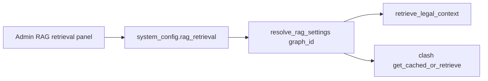

# Admin: per-graph RAG retrieval thresholds

## Context

- Nav lives in [`web_app/components/admin/admin-nav-config.ts`](web_app/components/admin/admin-nav-config.ts); tabs switch in [`AdminDashboard.tsx`](web_app/components/admin/AdminDashboard.tsx).
- Existing **RAG funnel** (`id: "rag"`) is **ingest/staging** (PDF → chunks → `legal_documents`), not query-time retrieval.
- Live retrieval today:
  - Chat / shared path: `LEGAL_RAG_TOP_K = 10` in [`backend/agents/common_utils.py`](backend/agents/common_utils.py) → `retrieve_legal_context` → `VectorDB.search_legal_documents`.
  - Clash: `CLASH_RAG_TOP_K = 5` in [`backend/agents/clash/retrieval.py`](backend/agents/clash/retrieval.py).
  - **No min-similarity filter** on legal match today (SQL `match_legal_documents` returns top-N by distance only). Scam-similarity code elsewhere uses `0.78` as a precedent for thresholding.
- Persistence pattern to mirror: `system_config` via [`admin_models.read_config_key` / `write_config_key`](backend/services/admin_models.py) and `PATCH /api/admin/system-config/{key}` (same as `graph_node_models` in [`AdminAiModelsSection.tsx`](web_app/components/admin/AdminAiModelsSection.tsx)).

## UX placement

Add a new Configuration nav item (not the ingest funnel):

- `id: "rag-retrieval"`, label **RAG retrieval**, icon e.g. `SlidersHorizontal` / `Database`, group **Configuration** (next to **AI & models**).
- Panel: one card per graph (`chat_agent`, `clash_agent`) with:
  - **top_k** (int, clamp e.g. 1–30)
  - **min_similarity** (float 0–1, optional; empty / 0 = no filter)
  - Save → `patchSystemConfig("rag_retrieval", …)`
- Defaults shown when unset: chat `10`, clash `5`, min_similarity `0` (disabled).



## Backend

1. **Config shape** (`system_config` key `rag_retrieval`):

```json
{
  "chat_agent": { "top_k": 10, "min_similarity": 0 },
  "clash_agent": { "top_k": 5, "min_similarity": 0 }
}
```

2. **Resolver** in [`admin_models.py`](backend/services/admin_models.py) (or small `rag_retrieval_config.py`): `get_rag_retrieval_settings(graph_id) -> {top_k, min_similarity}` with defaults + clamp.

3. **Apply at retrieve**:
   - [`retrieve_legal_context`](backend/agents/common_utils.py): use resolved `top_k` (default graph `chat_agent`); after rows return, drop those with `similarity < min_similarity` when threshold &gt; 0.
   - Clash [`retrieve_law_context` / `get_cached_or_retrieve`](backend/agents/clash/retrieval.py): resolve as `clash_agent`; include `min_similarity` in cache key fingerprint so threshold changes don’t reuse stale hits.
   - Thread `min_similarity` through [`VectorDB.search_legal_documents`](backend/database/vector_db.py) if easier than post-filter; post-filter on returned rows is enough for v1 (no SQL migration required).

4. **API**: reuse existing system-config GET/PATCH; optional thin `GET /api/admin/rag-retrieval` that returns defaults merged with stored (like rag funnel config) for cleaner UI load.

## Frontend

- Extend [`AdminTabId` + `ADMIN_NAV`](web_app/components/admin/admin-nav-config.ts).
- New [`AdminRagRetrievalPanel.tsx`](web_app/components/admin/AdminRagRetrievalPanel.tsx) (compact, same tokens as AI models section).
- Wire in [`AdminDashboard.tsx`](web_app/components/admin/AdminDashboard.tsx).
- [`adminApi`](web_app/lib/adminApi.ts): load/save helpers for `rag_retrieval`.

## Out of scope

- RAG funnel ingest settings (unchanged).
- Per-node RAG overrides (graph-level only).
- Cursor-style Clash feed / admin interrupt badge plans (separate).

## Acceptance

- Admin can set different `top_k` / `min_similarity` for chat vs clash; values persist across refresh.
- Next Clash / chat RAG call uses new thresholds without redeploy.
- Invalid values clamped; unset keys fall back to current hardcoded defaults.
