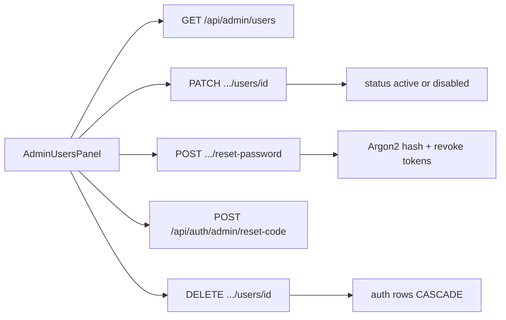

# Admin user management tab

## Context

- Deeptech reference UI: [`reference/deeptechknowledge ref/components/admin/AdminUsersTab.tsx`](reference/deeptechknowledge%20ref/components/admin/AdminUsersTab.tsx) — role sidebar filters, debounced search, 25/page, row → detail modal, manual password set + email reset.
- Nyaya already has **read** APIs: `GET /api/admin/users` + `GET /api/admin/users/{id}` in [`backend/routes/admin_routes.py`](backend/routes/admin_routes.py) / [`backend/services/admin_cases.py`](backend/services/admin_cases.py), used by Cases → UsersView. The nav tab `users` is only [`AdminUsersPanel.tsx`](web_app/components/admin/AdminUsersPanel.tsx) (reset-code issuer).
- Schema already supports restrict: `users.status` ∈ `active | disabled | pending_reset`; auth rejects `disabled` ([`auth_middleware.py`](backend/database/auth_middleware.py)). Passwords use Argon2 in [`auth_service.py`](backend/database/auth_service.py).

**Defaults locked in:** Restrict = set `status=disabled` (restore → `active`). Delete = hard `DELETE` of the user row (auth tables cascade). Keep existing reset-code flow inside the modal (Nyaya has no Deeptech-style email temp password). Only `super_admin` may mutate other `admin`/`super_admin` accounts; nobody can disable/delete themselves.

## Backend

Add service helpers (prefer new slim [`backend/services/admin_users.py`](backend/services/admin_users.py); keep list/get in `admin_cases` or move if cleaner) and wire routes next to existing user GETs:

| Method | Path | Behavior |
|--------|------|----------|
| `PATCH` | `/api/admin/users/{user_id}` | Update `status` (`active`/`disabled`) and optionally `role`, `display_name`. Clear `locked_until` / `failed_login_attempts` when re-enabling. |
| `POST` | `/api/admin/users/{user_id}/reset-password` | Body `{ new_password }` (min length). Hash via existing Argon2 helper; set `password_reset_required=false`, `status=active`; revoke refresh tokens for that user. |
| `DELETE` | `/api/admin/users/{user_id}` | Hard delete after guards. |

**Guards (all mutations):**
- Target exists; actor ≠ target for disable/delete.
- Block deleting/disabling the last `super_admin`.
- Non–`super_admin` cannot change users with role `admin` or `super_admin`.
- Write `admin_audit_logs` (reuse `_audit` pattern from [`admin_db.py`](backend/services/admin_db.py) or equivalent insert).

**List/detail enrichment:** Include `password_reset_required`, `failed_login_attempts`, `locked_until` on list/get rows (still never expose `password_hash`).

Existing `POST /api/auth/admin/reset-code` stays; UI calls it from the modal for the code path.

## Frontend

1. **Nav** — In [`admin-nav-config.ts`](web_app/components/admin/admin-nav-config.ts): change `users` label from "Reset codes" → **Users**, icon `Users` (lucide), group **Auth**.

2. **Rewrite** [`AdminUsersPanel.tsx`](web_app/components/admin/AdminUsersPanel.tsx) (or rename to `AdminUsersTab.tsx` and update [`AdminDashboard.tsx`](web_app/components/admin/AdminDashboard.tsx)) to mirror Deeptech layout using existing [`AdminPageLayout`](web_app/components/admin/AdminPageLayout.tsx) + [`admin-ui`](web_app/components/admin/admin-ui.tsx):
   - Sidebar: role filters (`all` + victim / sahayak / lawyer / moderator / admin / super_admin) + debounced search (email / mobile / display_name / id).
   - Main: toolbar Prev/Next (page size 25), table columns: #, Display name, Email, Mobile, Role, Status, Must reset, Created.
   - Row click → modal: profile fields, Restrict / Unrestrict, Delete (typed confirm or `window.confirm` with strong wording), Manual set password, Generate reset code (show code like today’s panel).

3. **Client API** — Extend [`adminApi.ts`](web_app/lib/adminApi.ts): `patchUser`, `resetUserPassword`, `deleteUser`; reuse `users` / `user` / `createResetCode`.

4. **Cases tab** — Leave [`AdminCasesPanel`](web_app/components/admin/AdminCasesPanel.tsx) UsersView for case drill-down; no duplicate manage actions there.

## Out of scope

- Changing Cases UsersView into full user admin.
- Emailing temporary passwords (Deeptech-only; Nyaya uses on-screen reset codes).
- Bulk actions / user create-invite.