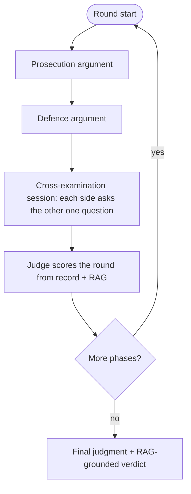

# Clash Mode: Role-Based Courtroom with RAG Grounding

## Goal
Turn Clash Mode from an "AI argues both sides, user is always the complainant" flow into a true courtroom sim:
- User picks a side: **Prosecutor** or **Defence**.
- **Practice**: user drives their own side each turn (argue / ask / answer), with a "let my counsel handle this" AI-assist fallback.
- **Real-life**: an AI lawyer argues the user's side; the user only answers factual questions posed by *either* their own counsel or the opponent.
- Judge hears both sides across multiple rounds, runs a cross-examination session each round, and delivers a final judgment.
- Every agent step (both counsel + judge) retrieves from `public.legal_documents` (embeddings RAG) and grounds citations in real Indian-law sections.

## Confirmed interaction model
- Practice: user has full control of their side but may delegate any turn to the AI.
- Real-life: AI lawyer argues; user answers questions from their own agent and the opponent agent.

## Current state (baseline)
- Graph: [backend/clash_graph.py](backend/clash_graph.py) wires `preprocess -> prosecution -> (defence_cross_answer?) -> defence -> judge_round -> ... -> final_judge`. Roles are hard-coded (user = complainant, only answers defence questions).
- Agents: [backend/agents/clash/](backend/agents/clash/prosecution.py) `prosecution.py`, `defence.py`, `defence_cross.py`, `judge.py`, `preprocess.py`, `incorporate.py`, prompts in `prompts.py`.
- Pause/resume: `awaiting_user_input` + `pending_question` + resume via `/answer` in [backend/clash_service.py](backend/clash_service.py).
- RAG is NOT used by clash today; retrieval exists via `VectorDB.search_legal_documents` in [backend/database/vector_db.py](backend/database/vector_db.py) (used by [backend/agents/civil_agent.py](backend/agents/civil_agent.py)).
- Frontend: [web_app/components/clash/ClashPageShell.tsx](web_app/components/clash/ClashPageShell.tsx), [web_app/hooks/useClashStream.ts](web_app/hooks/useClashStream.ts), [web_app/lib/clashApi.ts](web_app/lib/clashApi.ts), transcript in [web_app/components/clash/ClashDebateTranscript.tsx](web_app/components/clash/ClashDebateTranscript.tsx).

## Per-round flow (each phase = opening, rebuttal, closing)

For any node whose `side == user_role`:
- AI-controlled (opponent, or user side in real-life): generate with RAG.
- User side in practice: pause for user input (`user_action` = argue/ask/answer) with AI-assist fallback.
- Question directed at the user party (either mode): pause for the user to answer; practice also allows delegate.

## RAG grounding (new)
New module `backend/agents/clash/retrieval.py`:
- Lazy `VectorDB()` singleton (mirror `civil_agent.py`).
- `retrieve_law_context(query, top_k=5, category=None) -> {context_text, citations[]}` calling `search_legal_documents`; `citations` carry `act_name`, `section_number`, `title`, `similarity`.
- Prompt formatter that injects an `=== INDIAN LAW ON RECORD (retrieved) ===` block and instructs the agent to cite ONLY retrieved sections in `law_sections`; graceful empty fallback when Postgres/embeddings unavailable.
- Query built from case facts + phase objective + latest opposing argument (cache per (phase, side) on state to limit latency/rate-limit exposure).

Wire into `prosecution.py`, `defence.py`, `defence_cross.py`, and both judge nodes in `judge.py`; emit a `rag_retrieved` stream event (citations) in [backend/clash_service.py](backend/clash_service.py).

## Backend changes
- Schemas [backend/clash_schemas.py](backend/clash_schemas.py): add `user_role: Literal["prosecution","defence"]` to `ClashSessionCreate` + `ClashSession`; extend `ClashAnswerRequest` with `delegate: bool = False` (AI-assist) and make `answer` optional when delegating; add `user_action`/`ai_assist_allowed`/`question_target` (now either side) to the stream event contract.
- State [backend/clash_graph.py](backend/clash_graph.py): add `user_role`, `user_action`, and a cross-exam bookkeeping field; add generic routing that decides AI vs user pause based on `user_role` + `mode`; add a `cross_exam` node between `defence` and `judge_round`.
- Agents: make `prosecution_turn_node`/`defence_turn_node` role-aware (pause when it's the user's side in practice; AI+RAG otherwise). Generalize `defence_cross.py` into an `ai_cross_answer` usable by either side. Add a `cross_exam` node that produces one question per side and routes each answer (AI vs user pause). `incorporate.py`: when resuming a user "argue"/"ask" action, store the user's text as that side's `*_output`/question; when `delegate` sentinel, jump to the AI path for that side.
- Prompts [backend/agents/clash/prompts.py](backend/agents/clash/prompts.py): parameterize identity by side (already split); add RAG context block; add judge prompts referencing retrieved authorities.
- Service [backend/clash_service.py](backend/clash_service.py): pass `user_role` into graph inputs; handle `delegate` on `/answer`; emit `rag_retrieved`; set `question_target` to the user's role side; include `user_action` in `question_request` payloads.
- API [backend/main.py](backend/main.py): `ClashSessionCreate`/`ClashAnswerRequest` already flow through existing endpoints; no new routes needed (role captured at session create).

## Frontend changes
- [web_app/lib/clashApi.ts](web_app/lib/clashApi.ts): add `user_role` to `createClashSession`; add `delegate` to `streamClashAnswer`; extend event/payload types (`user_action`, `ai_assist_allowed`, `rag_retrieved`, generalized `question_target`).
- Setup UI [web_app/components/clash/ClashPageShell.tsx](web_app/components/clash/ClashPageShell.tsx) + a new Role selector (reuse pattern from [ClashModeSelector.tsx](web_app/components/clash/ClashModeSelector.tsx)): choose Prosecutor/Defence; show a role badge in the debate header.
- Hook [web_app/hooks/useClashStream.ts](web_app/hooks/useClashStream.ts): handle `rag_retrieved`, generalized question targets, and `user_action`; extend `pendingQuestion` with `userAction`/`aiAssistAllowed`; `submitAnswer(questionId, answer, { delegate })`.
- Input UI [web_app/components/clash/ClashDebateTranscript.tsx](web_app/components/clash/ClashDebateTranscript.tsx) + [ClashQuestionCard.tsx](web_app/components/clash/ClashQuestionCard.tsx): render an input matched to `user_action` (argue = large textarea; ask = question box; answer = answer box) plus a "Let my counsel handle this" button when `ai_assist_allowed`. Show retrieved authorities as citation chips (reuse existing `lawSections` rendering).

## Notes / risks
- More LLM + embedding calls per round increases latency and OpenRouter free-tier rate-limit risk; mitigate by caching RAG per phase/side and keeping `top_k` small.
- RAG requires `DATABASE_URL` + the embeddings endpoint (already used elsewhere); all agents fall back to ungrounded output if retrieval returns nothing.
- Keep the 3-phase arc (opening/rebuttal/closing) to bound LLM cycles.
