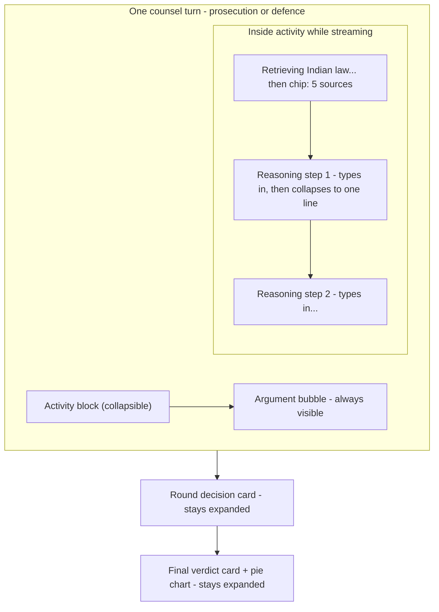

# Clash Mode: Cursor-style streaming feed

Frontend-only change. The backend already emits everything needed in order (`rag_retrieved` → `reasoning_step` × N → `stream_token`s → `stream_end`, plus `round_complete`, `judge_verdict_*`, `final_result`) — consumed in [web_app/hooks/useClashStream.ts](web_app/hooks/useClashStream.ts) and rendered by [web_app/components/clash/ClashDebateTranscript.tsx](web_app/components/clash/ClashDebateTranscript.tsx).

## Target behavior (like Cursor's agent activity)

- While a side is thinking: the activity block is open; each step streams in with a typewriter reveal (steps arrive whole per `reasoning_step` event, so reveal is client-side), and the previous step collapses to a single line when the next arrives.
- When the argument starts streaming (`stream_start`/first `stream_token` for that side): the whole activity block auto-collapses to a summary row — e.g. "Thought for the opening · 4 steps · 5 sources" — with a chevron to re-expand.
- Milestones never collapse: case facts card, argument bubbles, `question`/`answer`/`cross_answer` entries, round score cards, and the judge verdict.
- Final verdict gets the pie chart inline (currently only in the sidebar) so mobile users see it in the feed too.
- Applies identically to both sides (Prosecutor and Defence lanes keep their left/right alignment and tint) and to the judge (verdict streaming already exists; its "logic reviewed" lines become a collapsed activity block above the verdict).
- Respect `prefers-reduced-motion`: no typewriter, instant collapse.

## Changes

### 1. Collapsible primitive — new [web_app/components/ui/collapsible.tsx](web_app/components/ui/collapsible.tsx)
Wrap `@base-ui/react/collapsible` (already available via Base UI; matches existing shadcn base-nova wrappers like `tabs.tsx`). Animate height with the standard Base UI pattern.

### 2. Turn grouping — [web_app/components/clash/ClashDebateTranscript.tsx](web_app/components/clash/ClashDebateTranscript.tsx)
Add a pure `groupEntries(entries)` step: consecutive `rag` + `reasoning` entries for the same side become an `activity` group attached to the next `stream` entry from that side (or standalone if the turn paused for user input). No changes to `ClashEntry` or `useClashStream` state shape — grouping is derived at render time, so stream handling stays untouched.

### 3. New `ClashActivityBlock` component — new [web_app/components/clash/ClashActivityBlock.tsx](web_app/components/clash/ClashActivityBlock.tsx)
- Open state while its turn is the live one (`isStreaming` and no argument yet); auto-collapses when the sibling argument bubble starts.
- Header summary: side, phase, step count, source count; spinner while live.
- Steps: RAG row first ("Retrieving Indian law…" → citation chips, reusing the citation rendering from the current `rag` entry), then reasoning steps with law-section chips (reuse visuals from [ClashReasoningBlock.tsx](web_app/components/clash/ClashReasoningBlock.tsx)).
- Per-step typewriter reveal (~15–25ms/word via rAF), previous step collapses to its first line; disabled under reduced motion.

### 4. Judge verdict + pie chart — [web_app/components/clash/ClashJudgmentCard.tsx](web_app/components/clash/ClashJudgmentCard.tsx)
Embed [ClashVerdictPieChart.tsx](web_app/components/clash/ClashVerdictPieChart.tsx) (existing SVG pie) and the parameter totals inside the final judgment card once `result` lands; keep the streamed explanation text on top. Sidebar copy stays as-is.

### 5. Wire-up — [web_app/components/clash/ClashPageShell.tsx](web_app/components/clash/ClashPageShell.tsx)
Pass `isStreaming` / live-turn info down so `ClashActivityBlock` knows when to auto-collapse; keep autoscroll pinned to bottom while blocks collapse (adjust the scroll anchor in the transcript).

## Not changing
- Backend stream contract, `useClashStream` event handling, role/mode tabs, question input flow (`ClashQuestionCard`), sidebar.
