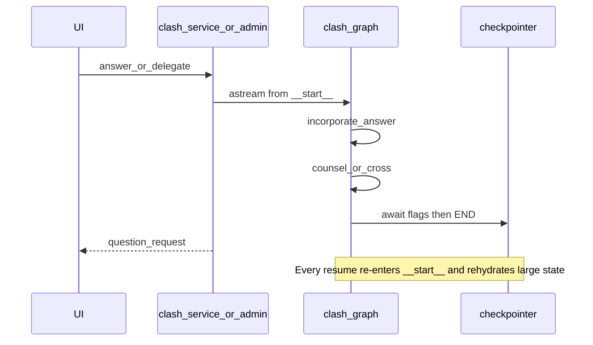
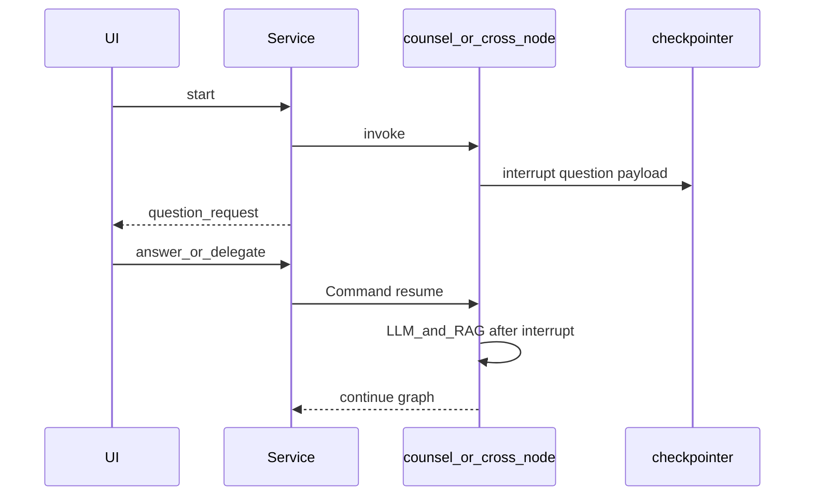

# Clash Mode efficiency refactor plan

## Hard constraint — one shared graph (user Clash + admin tester)

All refactor work targets the **single** compiled graph `backend.clash_graph.clash_graph`, loaded only through [`clash_runtime.get_clash_graph()`](backend/services/clash_runtime.py).

| Surface | Entry | Must stay on the same graph |
|---------|--------|-----------------------------|
| User `/clash` | [`clash_service.py`](backend/clash_service.py) → `get_clash_graph()` | Yes — NDJSON stream + session pause/resume |
| Admin LangGraph tester | [`graph_registry.py`](backend/services/graph_registry.py) → same `get_clash_graph()` / `clash_agent` registry | Yes — runs, resume, live path, awaiting prompts |

**Do not** fork an admin-only or user-only StateGraph. Differences stay in wrappers only:

- User: streaming + in-memory session snapshots
- Admin: DB node events / fork / replay / inspector

Shared contracts both wrappers must keep: `build_clash_start_inputs` / resume via interrupt+`Command`, pause payload fields mapped to `question_id` + `ai_assist_allowed`, and `round_scores` / `final_result` shapes.

Every task below is validated on **both** surfaces before the next task starts (admin tester first for isolation, then one practice `/clash` smoke).

---

## Current baseline (what we are replacing)

Pause nodes today: [`prosecution.py`](backend/agents/clash/prosecution.py), [`defence.py`](backend/agents/clash/defence.py), [`cross_exam.py`](backend/agents/clash/cross_exam.py) set `awaiting_user_input` + `next_step: wait_user`; routers in [`clash_graph.py`](backend/clash_graph.py) return `END`. Resume always goes `__start__` → [`incorporate_answer`](backend/agents/clash/incorporate.py) via [`clash_runtime.build_clash_resume_inputs`](backend/services/clash_runtime.py).

**Implementation order (testable increments):** 7 → 8 → 1 → 2 → 3 → 4 → 5 → 9 → 6. Task numbers below stay as specified; do them in that order when coding.

**Global rollback:** feature flag `CLASH_EFFICIENCY_V2=0` keeps old END/resume path until interrupt path is green in **admin tester and** `/clash` (same graph, both wrappers).

**In-flight sessions:** any task marked **migration** requires abandoning old paused threads (new `session_id` / admin run) or a one-shot resume adapter; do not mix old and new checkpoint shapes mid-debate.

---

## Task 7 — Trim static fields out of per-step state payload
**Savings: High** · **Schema migration: Yes**

| | |
|---|---|
| **Files** | [`clash_graph.py`](backend/clash_graph.py) (`ClashState`), [`clash_runtime.py`](backend/services/clash_runtime.py), [`preprocess.py`](backend/agents/clash/preprocess.py), counsel/cross/judge nodes that read `case_facts` / `case_title` / `judge_parameters`, [`clash_service.py`](backend/clash_service.py) session mirror |
| **Change** | Move `case_title`, `case_facts`, `mock_case_id`, `session_id`, `judge_parameters` into LangGraph `configurable` (set once in `clash_thread_config` / start invoke). Nodes read via `RunnableConfig` / `get_config()`. Keep only mutable debate fields in `ClashState`. Preprocess writes statics into config once, not into every return dict. |
| **Why** | Trace showed these re-emitted on almost every step; they dominate tokenized state and admin event I/O. |
| **Risk / rollback** | Nodes that only read `state["case_facts"]` break until updated. Session API still exposes title/facts from session object (unchanged UX). Rollback: put fields back on state in preprocess. Old checkpoints missing config statics fail resume → start new session. |

---

## Task 8 — Reduce transcript / logic_log duplication
**Savings: High** · **Schema migration: Yes**

| | |
|---|---|
| **Files** | [`clash_graph.py`](backend/clash_graph.py) (`Annotated` reducers on `transcript_entries`, `logic_log`, `user_answers`, `asked_questions`, `round_scores`), all nodes that currently `list(state.get(...))` + full replace, [`utils.py`](backend/agents/clash/utils.py) (`build_clash_conversation_context`, `format_asked_questions_block`), counsel/judge prompts |
| **Change** | Add list reducers (`operator.add` or append-only custom). Nodes return **only new entries**. Prompt builders use last-N transcript window + short phase digest (not full history every call). Judge keeps enough rounds for scoring via `round_scores` + last-N logic lines. |
| **Why** | Linear growth of full lists in every LLM-bound state/event is the other major token sink. |
| **Risk / rollback** | Mixing full-list returns with reducers duplicates entries. Ship reducer + convert all writers in one PR slice. Rollback: remove `Annotated`, restore full-list copies. In-flight sessions with old full lists still load; do not resume mid-flight across the cut. |

---

## Task 1 — Replace END / `__start__` pause with `interrupt()` + `Command(resume=...)`
**Savings: High** · **Schema migration: Yes**

| | |
|---|---|
| **Files** | [`clash_graph.py`](backend/clash_graph.py) (remove pause→`END` / `wait_user` routes), [`prosecution.py`](backend/agents/clash/prosecution.py), [`defence.py`](backend/agents/clash/defence.py), [`cross_exam.py`](backend/agents/clash/cross_exam.py), [`incorporate.py`](backend/agents/clash/incorporate.py) (retire or shrink), [`clash_runtime.py`](backend/services/clash_runtime.py) (**shared** start/resume helpers used by both surfaces), [`clash_service.py`](backend/clash_service.py) (`stream_debate` / `stream_answer`), [`graph_registry.py`](backend/services/graph_registry.py) (`resume_and_run_test`, `extract_awaiting_input`) |
| **Change** | On user-required argue/ask/answer: build the same interrupt payload the UI already understands (`pending_question`, `pending_question_id`, `user_action`, `ai_assist_allowed`, `question_target`, …), call `interrupt(payload)` **before** any LLM/RAG for that turn. Resume with `Command(resume={answer|delegate})` on the same `thread_id`. Map interrupt value → existing stream `question_request` **and** admin `awaiting_input.prompts` so **both** frontends keep stable contracts. Delete `__start__` → `incorporate_answer` fake-resume path once **user and admin** resume both use `Command` against the same graph. |
| **Why** | Removes ~10 `__start__` + ~9 `incorporate_answer` hops per debate (verified in [`docs/clash-mode-input-output.json`](docs/clash-mode-input-output.json)); largest hop/latency win. |
| **Risk / rollback** | Checkpointer already required (keep Postgres checkpointer). Interrupt re-runs node code above `interrupt()` — keep RAG/LLM **after** interrupt. Flag `CLASH_EFFICIENCY_V2` restores END/incorporate for the shared graph. Old paused sessions cannot resume on new code. |

---

## Task 2 — Collapse `cross_exam` into one node + internal stage machine
**Savings: High** · **Schema migration: Low** (keep `cross_exam_stage`)

| | |
|---|---|
| **Files** | [`cross_exam.py`](backend/agents/clash/cross_exam.py), [`clash_graph.py`](backend/clash_graph.py) (drop `cross_exam`→`cross_exam` self-edge spam where possible; keep `ai_cross_answer` edge only if still needed), [`ai_cross_answer.py`](backend/agents/clash/ai_cross_answer.py) |
| **Change** | Single `cross_exam` node owns stages `p_ask → d_answer → d_ask → p_answer → done` in Python. While both sides for a half-turn are AI: one structured LLM call returning `{question, answer}` (or question then local answer schema in one response). When the user must ask or answer: `interrupt()` once, then continue stages in the same node invocation after resume—no remount via `next_step: cross_exam` for every micro-stage. Fold `ai_cross_answer` into this node when answerer is AI (delete separate hop). |
| **Why** | Trace had 12 `cross_exam` + 6 `ai_cross_answer` visits; each resent full context. |
| **Risk / rollback** | Combined ask+answer only when both AI; user-involved half still two logical turns (interrupt + continue) but one graph node. Rollback: restore stage self-edges + `ai_cross_answer` node. |

---

## Task 3 — Prevent duplicate argue re-entry after judge
**Savings: Medium** · **Schema migration: No**

| | |
|---|---|
| **Files** | [`prosecution.py`](backend/agents/clash/prosecution.py), [`defence.py`](backend/agents/clash/defence.py), [`judge.py`](backend/agents/clash/judge.py) (clears `prosecution_output`/`defence_output` today—adjust), [`roles.py`](backend/agents/clash/roles.py) optional helper |
| **Change** | Guard: if `transcript_entries` already has `kind=argument` for `(side, current phase)`, skip pause/LLM and route to next step (defence / cross_exam / judge). After `judge_round`, clearing outputs is fine; **do not** re-open argue for a phase that already has transcript arguments. New phase correctly has no argument yet → normal argue/pause. |
| **Why** | Stops redundant argue pauses after phase transitions when AI already spoke. |
| **Risk / rollback** | False positive if transcript write failed but outputs existed—check both transcript and non-empty `*_output` for current phase. Easy guard revert. |

---

## Task 4 — Fail loud + bounded retry on bad counsel JSON
**Savings: Medium** (quality; avoids wasted judge tokens on garbage) · **Schema migration: No**

| | |
|---|---|
| **Files** | [`utils.py`](backend/agents/clash/utils.py) (`parse_agent_response`), [`prosecution.py`](backend/agents/clash/prosecution.py), [`defence.py`](backend/agents/clash/defence.py), [`cross_exam.py`](backend/agents/clash/cross_exam.py), [`ai_cross_answer.py`](backend/agents/clash/ai_cross_answer.py), optionally [`judge.py`](backend/agents/clash/judge.py) |
| **Change** | After first parse: if missing required `argument` / malformed structure, one repair `llm.invoke` with “return valid JSON only” + prior raw text. Second failure → explicit error state / stream error (do not append broken fragments to `logic_log` / transcript). Judge: if score JSON fails after one repair, use heuristics only when inputs are coherent; otherwise surface judge error rather than scoring `"reasoning_steps": [` stubs. |
| **Why** | Real run fed truncated counsel JSON into scoring. |
| **Risk / rollback** | +1 LLM call on failure path only. Rollback: restore single-parse fallbacks. |

---

## Task 5 — RAG cache reuse + purge `pending_rag_citations`
**Savings: Medium** · **Schema migration: No** (cache key format change is runtime-only)

| | |
|---|---|
| **Files** | [`retrieval.py`](backend/agents/clash/retrieval.py), all RAG callers, [`clash_service.py`](backend/clash_service.py) citation emit, counsel/cross/judge returns |
| **Change** | Key `rag_cache` by `hash(case_id|mock_case_id + phase + side + fact_fingerprint)` where fingerprint is stable hash of `case_facts` (from config after Task 7). Skip retrieve on hit. After folding citations into `law_sections` / streaming `rag_retrieved`, return `pending_rag_citations: None` (and clear pending reasoning/law ephemerals) so snapshots do not carry raw citation blobs for 3–4 steps. |
| **Why** | Same phase/side was re-keyed weakly; citations lingered in state. |
| **Risk / rollback** | Over-broad cache hit if facts change mid-session (rare)—fingerprint invalidates. Rollback: restore `f"{phase}:{side}"` keys. |

---

## Task 9 — Deduplicate reasoning / law_sections storage
**Savings: Medium** · **Schema migration: Yes**

| | |
|---|---|
| **Files** | [`clash_graph.py`](backend/clash_graph.py) state fields, counsel nodes, [`clash_service.py`](backend/clash_service.py) `_emit_agent_turn` / snapshot sync, frontend only if it reads top-level `prosecution_reasoning` (verify stream payload; prefer transcript) |
| **Change** | Canonical store: `transcript_entries` (+ `logic_log` for judge). Remove top-level `prosecution_reasoning`, `defence_reasoning`, `prosecution_law_sections`, `defence_law_sections` from state once stream adapters derive the same fields from the latest transcript entry. Keep `prosecution_output` / `defence_output` as short “current phase argument” working registers cleared by judge, or derive from last argument entry—pick **derive from transcript** to avoid dual writes. |
| **Why** | Same facts stored three ways per side. |
| **Risk / rollback** | Stream adapters must be updated in the same change. Rollback: restore top-level fields as mirrors of last transcript entry. |

---

## Task 6 — Admin monitoring via checkpoint state
**Savings: Low–Medium** (ops/debug bandwidth, not user LLM cost) · **Schema migration: No**

| | |
|---|---|
| **Files** | [`graph_registry.py`](backend/services/graph_registry.py), [`LangGraphTester.tsx`](web_app/components/admin/LangGraphTester.tsx) |
| **Change** | Default admin Clash run view: surface `final_state.round_scores` / `final_result` / pause prompts from checkpoint (already partially via `extract_awaiting_input`). Gate full per-node event I/O + Copy live JSON behind `debug_events=true` (query/UI toggle). Keep streaming events for live path animation, but do not require them for judgment monitoring. |
| **Why** | Event I/O was truncated/wrong; judgments live in checkpoint. |
| **Risk / rollback** | Toggle off restores current always-on event inspector. |

---

## Relative savings summary

| Task | Token/call savings | Hop savings | Migration |
|------|--------------------|-------------|-----------|
| 7 Static → config | **High** | — | Yes |
| 8 Reducers + window window | **High** | — | Yes |
| 1 interrupt resume | Medium tokens | **High** | Yes |
| 2 cross_exam collapse | **High** | **High** | Low |
| 3 skip duplicate argue | Medium | Medium | No |
| 4 JSON retry | Quality / less wasted judge | +1 on failure | No |
| 5 RAG hash + purge | Medium | — | No |
| 9 dedupe fields | Medium | — | Yes |
| 6 admin checkpoint | Low LLM | — | No |

## Acceptance checks (per task when implementing)

1. **Same graph:** `get_clash_graph()` is the only Clash compile path; admin `clash_agent` and user Clash both invoke it (no duplicate StateGraph).
2. Practice + Real Life on **user** `/clash`: ask / answer / argue + “Let AI counsel handle this” still works.
3. **Admin** LangGraph tester on the same graph: pause prompts + resume/delegate; `round_scores` / `final_result` shape unchanged.
4. Live path length for a full practice debate drops substantially (target: no `__start__`/`incorporate` pairs per pause; cross-exam visits ≪ 12).
5. Bad counsel JSON: one repair then explicit error, never silent garbage in `logic_log`.
6. Old paused threads: documented as unsupported across the interrupt cut; new session / admin run required.
