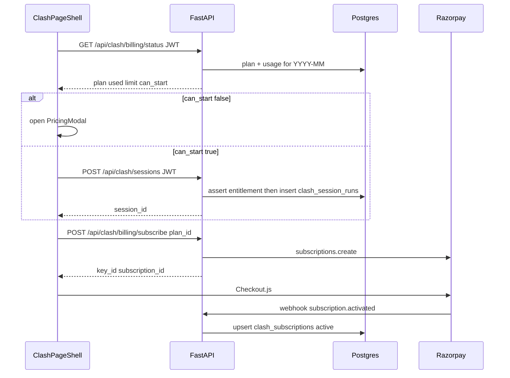

# Clash Mode pricing + Razorpay subscriptions

## Product rules (locked)

| Plan | Price | Clash sessions / calendar month (UTC) |
|------|-------|----------------------------------------|
| Free | ₹0 | 2 |
| Basic | ₹49 / month | 50 |
| Fearless | ₹599 / month | Unlimited |

A **session** = one successful `POST /api/clash/sessions` (Begin Debate). Stream restarts on the same session do not burn another quota unit.

## Architecture

## Schema — new migration [`backend/database/migrations/032_clash_billing.sql`](backend/database/migrations/032_clash_billing.sql)

- `clash_plans` — seed rows: `free`, `basic`, `fearless` with `price_paise` (0 / 4900 / 59900), `monthly_session_limit` (2 / 50 / NULL), `razorpay_plan_id` (nullable until Dashboard IDs filled).
- `clash_subscriptions` — `user_id` → `users.id`, `plan_id`, `status` (`active`/`cancelled`/`past_due`/`created`), `razorpay_subscription_id`, `razorpay_customer_id`, `current_period_start`, `current_period_end`, unique on active subscription per user.
- `clash_session_runs` — durable ledger: `id`, `user_id`, `session_id`, `mode`, `created_at`. Index `(user_id, created_at)`.
- `clash_billing_events` — webhook idempotency: `razorpay_event_id` UNIQUE, payload jsonb, processed_at.

No change to in-memory Clash session store beyond the create gate.

## Backend

New module [`backend/services/clash_billing.py`](backend/services/clash_billing.py) + routes [`backend/routes/clash_billing_routes.py`](backend/routes/clash_billing_routes.py) (mounted in `main.py`):

| Endpoint | Auth | Role |
|----------|------|------|
| `GET /api/clash/billing/status` | JWT | plan, used, limit, can_start, period |
| `GET /api/clash/billing/plans` | JWT | public plan catalog for modal |
| `POST /api/clash/billing/subscribe` | JWT | body `{plan_id: basic\|fearless}` → create Razorpay subscription, return `{key_id, subscription_id, plan_id}` |
| `POST /api/clash/billing/webhook` | Razorpay signature | activate/cancel/past_due; never trust client for plan changes |
| `POST /api/clash/billing/cancel` | JWT | cancel at period end |

**Entitlement helper** `assert_can_start_clash(user_id)`:
- Resolve effective plan from active `clash_subscriptions` whose period covers now; else Free.
- Count `clash_session_runs` for `date_trunc('month', now() AT TIME ZONE 'UTC')`.
- If limit not null and used >= limit → `HTTP 402` with `{code: "clash_quota_exceeded", plan, used, limit}`.

**Gate** [`backend/main.py`](backend/main.py) `clash_create_session`: require `Depends(get_current_user)` (same pattern as moderator/lawyer), call assert, then `create_session`, then insert `clash_session_runs`. Do not rely on client-supplied `user_id` alone.

Env vars: `RAZORPAY_KEY_ID`, `RAZORPAY_KEY_SECRET`, `RAZORPAY_WEBHOOK_SECRET`. Optional `RAZORPAY_BASIC_PLAN_ID` / `RAZORPAY_FEARLESS_PLAN_ID` override DB columns.

Dependency: add `razorpay` to [`requirements.txt`](requirements.txt).

## Frontend

- [`web_app/lib/clashBillingApi.ts`](web_app/lib/clashBillingApi.ts) — status/plans/subscribe/cancel with Bearer token (same as `moderatorApi`).
- [`web_app/components/clash/ClashPricingModal.tsx`](web_app/components/clash/ClashPricingModal.tsx) — floating overlay (high z-index above Bench drawer), three tiers, current plan badge, usage meter on Free/Basic, Razorpay Checkout on paid CTAs.
- [`web_app/components/clash/ClashPageShell.tsx`](web_app/components/clash/ClashPageShell.tsx):
  - Persistent **Upgrade** control in header right cluster (setup + debate).
  - Load billing status on mount; show “2 left this month” style hint when Free/Basic.
  - On `handleStart`, if `!can_start` open modal; if API returns 402 open modal.
  - Load Razorpay Checkout script once; on subscribe response open `new Razorpay({ key, subscription_id, ... })`.
- Pass JWT into Next clash proxies / `clashApi` for create (mirror lawyer chat auth headers).

Visual direction: keep Clash emerald `#00634B`; pricing modal as one composition (brand + three columns + one CTA group), no card-stack hero clutter; Fearless visually dominant.

## Razorpay setup guide (you do in Dashboard; code consumes IDs)

1. Create Razorpay account (Test mode first) → **Settings → API Keys** → copy Key ID + Secret into server env.
2. **Subscriptions → Plans** → create two **monthly** plans in INR:
   - Basic: ₹49, interval monthly → copy Plan ID → store in `clash_plans.razorpay_plan_id` for `basic` (or env).
   - Fearless: ₹599, interval monthly → same for `fearless`.
3. **Settings → Webhooks** → URL `https://YOUR_API/api/clash/billing/webhook`, secret → `RAZORPAY_WEBHOOK_SECRET`. Subscribe at least: `subscription.activated`, `subscription.charged`, `subscription.cancelled`, `subscription.completed`, `subscription.pending`, `payment.failed`.
4. Frontend only ever sees `RAZORPAY_KEY_ID` (public). Never expose Key Secret or webhook secret.
5. Test with Razorpay test cards; switch to Live keys + Live plan IDs before production.

## Out of scope

- Persisting full Clash debate transcripts (only usage ledger).
- Annual billing, trials, coupons, GST invoices.
- Admin UI to edit plan prices (seed + Razorpay Dashboard for v1).
