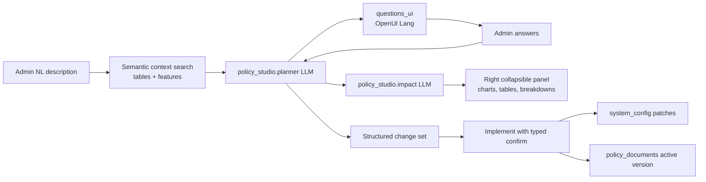

## Improvise Policies Studio (admin)

### Decisions committed
- **Implement scope**: applies whitelisted `system_config` patches + activates a versioned policy text injected into agent prompts. Schema/code changes are emitted as a **manual follow-ups checklist**, never auto-applied.
- **GenUI**: install `@openuidev/react-lang` + `@openuidev/react-ui`; the frontend sends `library.prompt()` with each request (no build step).
- **Model selection**: new `policy_studio` graph nodes in the existing **AI & models** tab, resolved through `resolve_node_model()`.

### Flow



---

## 1. OpenUI skill + packages
- Copy `.agents/skills/openui/` (SKILL.md + `references/`) to `.cursor/skills/openui/` so it sits beside `context7-mcp` and `impeccable`.
- `cd web_app && npm i @openuidev/react-lang @openuidev/react-ui zod`

## 2. Tab wiring
- [web_app/components/admin/admin-nav-config.ts](web_app/components/admin/admin-nav-config.ts): add `"policies"` to `AdminTabId` and

```ts
{ id: "policies", label: "Improvise policies", icon: ScrollText, group: "Configuration" },
```

- [web_app/components/admin/AdminDashboard.tsx](web_app/components/admin/AdminDashboard.tsx): `{tab === "policies" && <AdminPolicyStudio />}`

## 3. Backend: context catalog + semantic search
- New migration `backend/database/migrations/0XX_policy_studio.sql`:
  - `policy_context_embeddings(kind, ref_id, title, content, embedding vector(768))` + `match_policy_context()` (mirrors `match_legal_documents`)
  - `policy_documents(id, title, description, policy_text, change_set jsonb, status, version, created_by, created_at, activated_at)`
- New `backend/services/policy_context.py`:
  - `feature_catalog()` built from `admin_db.schema_catalog()` + `graph_registry` + a static feature registry (chat agent nodes, moderator queue, nodal-guide forwarding, lawyer browse, NyaySahayak ₹49, scam heatmap, RAG funnel, billing) with related tables/config keys.
  - `reindex_policy_context()` via `embed_texts()` (uses admin-selected embedding model); register scope `policy_context` in [backend/services/embedding_admin.py](backend/services/embedding_admin.py).
  - `search_policy_context(query, top_k)` via `embed_query()`.

## 4. Backend: policy studio orchestration
- New `backend/services/policy_studio.py` — planner/question/impact/implement steps using `invoke_llm_with_selection(task_id="policy_studio.<node>")`.
- New `backend/services/policy_impact.py` — read-only aggregates (cases by category/criticality/state, user counts, forwards, lawyer/nodal usage, ₹49 bookings, AI usage) that feed the impact LLM.
- New `backend/routes/policy_routes.py` mounted at `/api/admin/policies` (pattern from [backend/routes/admin_routes.py](backend/routes/admin_routes.py), `AdminUser` dep):
  - `POST /context/search`, `POST /context/reindex`
  - `POST /draft/stream` and `POST /answers/stream` → **NDJSON** (`StreamingResponse(media_type="application/x-ndjson")`, same as chat stream) emitting `context`, `questions_ui`, `impact_ui`, `change_set`, `done`
  - `GET /`, `GET /{id}`, `POST /{id}/implement`, `POST /{id}/rollback`

Change set contract:

```json
{
  "summary": "...",
  "config_changes": [{"key":"rag_retrieval","path":"chat_agent.top_k","from":10,"to":6,"reason":"..."}],
  "policy_text": "markdown rules injected into agents",
  "agent_scope": ["chat_agent.supervisor","chat_agent.suggested_actions"],
  "manual_followups": [{"title":"...","detail":"...","risk":"high"}],
  "risk": "medium"
}
```

Implement is whitelisted to `rag_retrieval`, `rag_funnel`, `graph_node_models`, `moderator_queue`, `scam_classifier`, `ai_embeddings`; it snapshots previous values into `change_set.previous`, writes via `write_config_key()`, and logs to `admin_audit_logs`. Anything outside the whitelist becomes a manual follow-up.

## 5. Policy injection into agents
- `active_policy_prompt_block(scope)` helper in [backend/agents/common_utils.py](backend/agents/common_utils.py) (TTL-cached), injected into the supervisor prompt in [backend/agent_graph.py](backend/agent_graph.py) and into [backend/agents/suggested_actions_agent.py](backend/agents/suggested_actions_agent.py).

## 6. Frontend: Policy Studio UI
New `web_app/components/admin/policy/`:
- `AdminPolicyStudio.tsx` — left workspace + right collapsible impact panel (default open on ≥1280px, toggle button persisted in `localStorage`).
- `PolicyComposer.tsx` — description textarea, attached-context chips, run button.
- `PolicyContextPicker.tsx` — semantic search over tables/features, plus **embedding model select** and **Regenerate embeddings** here (reuses `adminApi.patchSystemConfig("ai_embeddings")` and `regenerateEmbeddingsAsync`, adding scope `policy_context`).
- `PolicyQuestionFlow.tsx` — renders `questions_ui` with OpenUI `<Renderer isStreaming>`; `onAction` collects answers and posts `/answers/stream`.
- `PolicyImpactPanel.tsx` — renders `impact_ui` with `<Renderer>`.
- `PolicyImplementDialog.tsx` — diff table, manual follow-ups, risk badge, requires typing `IMPLEMENT`.
- `policy-genui-library.ts` — `createLibrary` with `Stack`, `Section`, `MetricCard`, `BarChart`, `LineChart`, `DataTable`, `CaseList`, `UserList`, `RiskCallout`, `QuestionForm`, `DiffTable`, `ImplementWarning`, built on `recharts` + `admin-ui` classes so it matches the dark admin theme.
- Extend [web_app/lib/adminApi.ts](web_app/lib/adminApi.ts) with `policyContextSearch`, `policyReindex`, `policyDraftStream`, `policyAnswersStream`, `policyList`, `policyImplement`, `policyRollback` (streams read `response.body` NDJSON like `ChatInterface`).

## 7. Model selection in AI & models
- [backend/services/admin_models.py](backend/services/admin_models.py): add `POLICY_NODES = ("planner", "question_gen", "impact", "implementer")`, defaults under `graph_node_models["policy_studio"]`, expose `policy_nodes` in `catalog`.
- [web_app/components/admin/AdminAiModelsSection.tsx](web_app/components/admin/AdminAiModelsSection.tsx): add a "Policy studio" section using the existing `AdminModelSelector` + `saveNode("policy_studio", …)`.

## 8. Embedding token accounting (bug fix)
Root cause: `log_ai_usage()` is only called from `invoke_llm_with_selection()` in [backend/utils.py](backend/utils.py); nothing in [backend/services/text_embeddings.py](backend/services/text_embeddings.py) logs usage, so `gemini-embedding-001` never appears in Overview totals.

- In `embed_texts()`, after a successful call, log usage:

```python
log_ai_usage(
    task=f"embedding.{task_type.lower()}",
    model=model or GEMINI_EMBEDDING_MODEL,
    provider=provider,
    prompt_tokens=sum(estimate_tokens(t) for t in cleaned),
)
```

Prefer real `usage_metadata` from the Google SDK response when present, falling back to the estimate.
- Add `"gemini"` to `EMBEDDING_PROVIDERS`/`EMBEDDING_MODELS` in `admin_models.py` so the GEMINI_API_KEY path is selectable distinctly from `vertex`.
- [web_app/components/admin/AdminOverviewTab.tsx](web_app/components/admin/AdminOverviewTab.tsx): add an "Embedding tokens" stat card sourced from `aiUsage` rows whose task starts with `embedding.`; existing `AdminAiUsageCharts` picks the new model up automatically.

## 9. Verification
- `python -c "import backend.services.policy_studio, backend.routes.policy_routes"` and run the migration.
- Reindex policy context, confirm search returns tables + features.
- Run a draft: questions render, answers loop, impact panel streams charts.
- Implement a low-risk config change, confirm `system_config` + `admin_audit_logs` + rollback.
- Trigger a RAG query and confirm `ai_usage_logs` now has `embedding.*` rows and Overview token counts move.