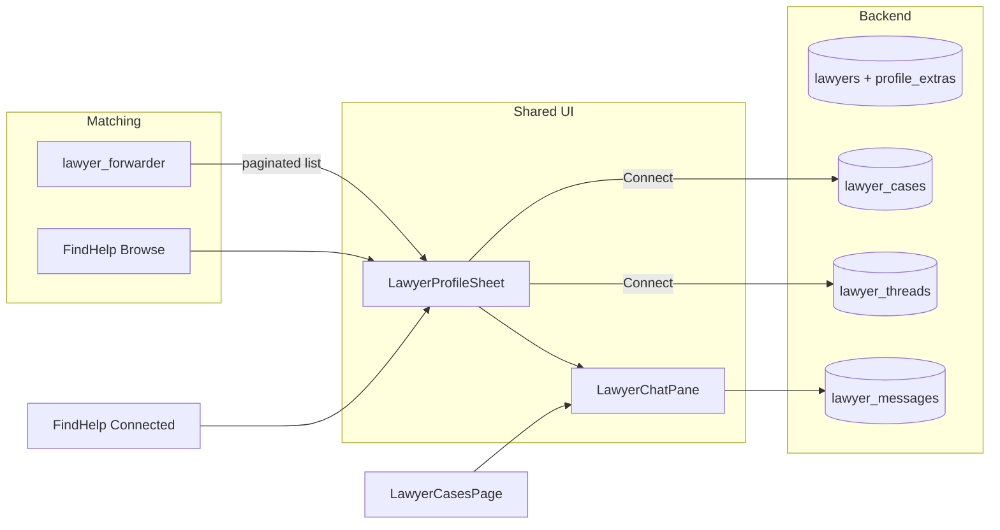

# Lawyer professional profile, matching sheet, and connect chat

## Current gaps
- Lawyer home ([`web_app/app/(dashboard)/lawyer/page.tsx`](web_app/app/(dashboard)/lawyer/page.tsx)) is dark/`neutral-900`; cases/profile already use `#00634B` / `#F8F9FA`.
- Profile fields are flat (name, one specialization, bio, rate, bar #). No multi practice areas, education, experience history, languages, courts, headline.
- [`LawyerBrowserPanel.tsx`](web_app/components/chat/LawyerBrowserPanel.tsx) has a fullscreen modal detail view, but Connect only accepts a `lawyer_cases` row — **no DM**.
- Find Help ([`find-help/page.tsx`](web_app/app/(dashboard)/find-help/page.tsx)) has browse cards; Consult Now is a no-op; no **Connected lawyers** subtab.
- Matching (`search_lawyers_by_specialization`) uses short ILIKE tokens (`Cyber`, `Criminal`) that poorly align with directory chips like `"Cyber & Financial Fraud"`.

## Architecture

**Defaults chosen**
- Extended profile stored as typed columns + `profile_extras jsonb` (education/experience arrays) — LinkedIn-style without exploding the table.
- Messaging: Postgres threads/messages + authenticated REST (list/send) with **3s client polling** (reuse patterns from existing WS presence later if needed).
- Connect creates/links a `lawyer_case` (when case context exists) **and** opens a `lawyer_thread` so chat works from chat panel, Find Help, and lawyer cases.

## 1. Schema + APIs
Add migration `022_lawyer_profile_and_chat.sql`:
- Extend `lawyers`: `headline`, `about`, `practice_areas text[]`, `courts_practiced text[]`, `languages text[]`, `city`, `state`, `availability_hours`, `consultation_modes text[]`, `website_url`, `linkedin_url`, `cover_image`, `profile_extras jsonb` (default `{}` for `education[]`, `experience_history[]`, `skills[]`).
- New `lawyer_threads` (`id`, `victim_user_id`, `lawyer_user_id`, `lawyer_case_id` nullable, `status`, timestamps, unique pair).
- New `lawyer_messages` (`id`, `thread_id`, `sender_user_id`, `body`, `created_at`).

Backend ([`backend/main.py`](backend/main.py), [`postgres_db.py`](backend/database/postgres_db.py)):
- Expand register/profile GET/PUT to read/write new fields.
- Align matching: map incident/case categories → canonical practice-area tokens that match directory enums (`Criminal Law`, `Cyber & Financial Fraud`, etc.); prefer `practice_areas` overlap, fallback specialization ILIKE + rating.
- Chat APIs (JWT): `POST /api/lawyer-chat/threads` (connect), `GET /api/lawyer-chat/threads`, `GET /api/lawyer-chat/threads/{id}/messages`, `POST .../messages`.
- Victim connected list: threads where `victim_user_id = me` joined to lawyer profile.
- Lawyer side: threads for `lawyer_user_id = me`, optionally filtered by accepted case.

## 2. Shared responsive UI components
New under `web_app/components/lawyer/`:
- **`LawyerProfileSheet`** — floating panel: desktop centered modal (~max-w-2xl), mobile full-height bottom sheet. Sections: cover/avatar, headline, stats, about, practice areas, courts, languages, education, experience, bar/contact, Connect + Open chat.
- **`LawyerChatPane`** — textual chat (message list, composer, poll). Embeddable inside the sheet or as a second step after Connect.
- **`LawyerListCard`** — compact card for paginated lists (chat match + Find Help).

Theme: `#00634B`, `#E6F0ED`, `#F8F9FA`, white cards, orange accent sparingly — match Find Help / main dashboard (no dark lawyer-only skin).

## 3. Lawyer portal (theme + profile builder + cases chat)
- Restyle [`lawyer/page.tsx`](web_app/app/(dashboard)/lawyer/page.tsx) to light emerald cards; wire live counts from cases/threads APIs.
- Rebuild [`lawyer/profile/page.tsx`](web_app/app/(dashboard)/lawyer/profile/page.tsx) as multi-section profile builder (About, Practice, Experience, Education, Availability, Links) with the same sheet preview; multi-select practice areas; editable education/experience lists.
- Upgrade [`lawyer/cases/page.tsx`](web_app/app/(dashboard)/lawyer/cases/page.tsx): keep pending/accepted split; on case select show case brief + **Message client** opening `LawyerChatPane` (create/get thread for that case). Responsive: stack list→detail→chat on mobile; side-by-side on `md+`.

## 4. Chat matching panel
Update [`LawyerBrowserPanel.tsx`](web_app/components/chat/LawyerBrowserPanel.tsx):
- Paginated personalized list (page size ~5) after category match.
- Row click → `LawyerProfileSheet` (not a separate ad-hoc fullscreen only).
- Connect → thread + existing accept flow when `lawyerCaseId` present → switch sheet to chat.
- Pass richer profile fields from forwarder payload once API returns them.

Wire [`ChatInterface.tsx`](web_app/components/chat/ChatInterface.tsx) accept handler to also open/create chat thread.

## 5. Victim Find Legal Help
Update [`find-help/page.tsx`](web_app/app/(dashboard)/find-help/page.tsx):
- Subtabs: **Browse network** | **Connected lawyers**.
- Browse: existing filters + card click opens `LawyerProfileSheet`; Connect starts thread (no chat-case required).
- Connected: list threads with last message preview; select → sheet with chat focused.
- Responsive filters (collapsible on mobile), sheet as bottom sheet on small screens.

## 6. Types / context
- Extend `LawyerProfile` type (shared) and [`LawyerContext.tsx`](web_app/context/LawyerContext.tsx) for new fields + connected-threads helper.
- Next proxies under `web_app/app/api/lawyer-chat/*` if the app already proxies lawyer routes that way; otherwise call backend with access token like other JWT calls.

## Out of scope (explicit)
- Video/voice consult, payments, LinkedIn OAuth import, realtime WS (polling MVP only), changing moderator/sahayak WS channels.
