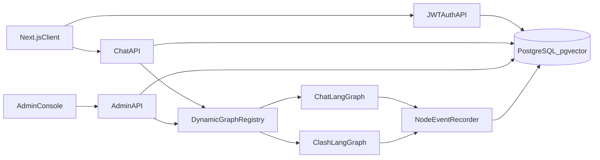

# Postgres and Dynamic LangGraph Admin

## Confirmed baseline
- The primary chat path is connected: `ChatInterface` → `/chat/stream` → compiled `agent_graph` → supervisor/conditional specialists → report or handoff nodes → streamed response. Clash Mode is a separate connected graph.
- The migration must address operational gaps rather than rebuild graph logic: process-local `MemorySaver`, hardcoded stream-node allowlists, incomplete schema-as-code, mixed Supabase/Firestore persistence, and the unimplemented `case_assignments` feature.
- Current Supabase dependencies include users, chat/case/handoff records, guide/lawyer directories, routing rules, scam/legal-document data, clash cases, attachments, and the `match_legal_documents` pgvector RPC.

## Architecture

## 1. Establish a reproducible Postgres schema
- Add Docker Compose for PostgreSQL with pgvector, health checks, persistent volumes, and separate app/admin credentials.
- Convert the actual access contract in [`database/supabase_db.py`](database/supabase_db.py), [`database/supabase_case_enhance.py`](database/supabase_case_enhance.py), existing SQL under [`scripts/sql`](scripts/sql), and seed scripts into ordered, reversible migrations.
- Cover every observed table: `users`, `chat_history`, `cases`, `interventions`, `sahayak_cases`, `sahayak_profiles`, `lawyers`, `lawyer_cases`, `case_attachments`, `mock_scams`, `legal_documents`, `clash_mock_cases`, `nodal_guides`, `routing_rules`, `female_lawyers`, `female_nyayguides`, plus `case_assignments` if the documented assignment workflow remains supported.
- Recreate `match_legal_documents` with pgvector indexes and add foreign keys, uniqueness, timestamps, lifecycle/status constraints, and indexes based on real query patterns.
- Add migration/seed commands and a schema verification test that fails when code references a missing relation or column.

## 2. Replace Supabase access with a Postgres repository layer
- Introduce pooled async Postgres access and repositories while preserving current service-level method signatures so agents and routes do not require broad rewrites.
- Replace all `supabase.table(...)`/RPC calls, then migrate seeders and legal-document ingestion.
- Remove Firestore data reads from [`web_app/context/CaseContext.tsx`](web_app/context/CaseContext.tsx) and the legal-rights UI, routing them through backend APIs backed by Postgres.
- Keep Cloudinary and the existing embedding service initially; isolate Pinecone behind its repository interface so vector consolidation can be done separately.
- Add parity tests for reads, writes, filters, pagination, transactions, and vector search before removing Supabase configuration.

## 3. Replace Firebase with JWT email/mobile authentication
- Store users locally with unique normalized email and mobile identifiers, Argon2id password hashes, role/status fields, failed-attempt tracking, and reset-required state.
- Implement short-lived access JWTs and rotating refresh tokens stored as hashes, with logout/revocation, role middleware, rate limiting, and audit events.
- Import existing user profiles without passwords and mark them `password_reset_required`; admins generate single-use, expiring reset codes from the admin console as requested.
- Replace Firebase client/session handling and backend Firebase verification across the web app and APIs. Remove credentials only after all protected routes pass role/ownership tests.
- Never expose password hashes, refresh-token hashes, or reset-code hashes through generic admin table APIs.

## 4. Make LangGraph discovery and execution dynamic
- Add a graph registry that imports each compiled graph (initially chat and clash), assigns a stable graph ID/version, and derives nodes and edges from `compiled_graph.get_graph(xray=True)` rather than maintaining node constants.
- Expose read APIs for graph metadata/topology and test-run APIs for creating, streaming, cancelling, and inspecting runs.
- Replace hardcoded stream allowlists in [`main.py`](main.py) with event metadata from LangGraph so newly added nodes automatically appear in streams and admin monitoring.
- Replace `MemorySaver` in [`agent_graph.py`](agent_graph.py) and [`clash_graph.py`](clash_graph.py) with a durable Postgres checkpointer suitable for restarts and multiple workers.
- Add graph integrity checks for entry reachability, orphan nodes, invalid conditional destinations, and topology changes; run them in tests and surface them in admin.

## 5. Persist node-by-node traces
- Add versioned records for graph definitions, test runs, node executions, transitions, and artifacts. Snapshot topology per graph version so historical runs remain understandable after code changes.
- Capture `astream_events` start/end/error events, sanitized node input/output, duration, token/model metadata where available, actual traversed edges, final state, and failure details.
- Enforce configurable redaction, payload-size limits, retention, and admin-only access because chat state can contain sensitive legal information.
- Support presets and arbitrary queries, optional initial state overrides, and whole-graph execution; do not permit direct isolated-node execution unless required state can be validated safely.

## 6. Build the reference-style admin console
- Reuse the shell/navigation patterns from [`reference/components/admin/AdminShell.tsx`](reference/components/admin/AdminShell.tsx), [`reference/components/admin/AdminDashboard.tsx`](reference/components/admin/AdminDashboard.tsx), and related admin UI primitives.
- Adapt [`reference/components/admin/AdminTablesTab.tsx`](reference/components/admin/AdminTablesTab.tsx) and [`reference/components/admin/AdminSqlTab.tsx`](reference/components/admin/AdminSqlTab.tsx) for schema browsing, filtered/paginated rows, guarded CRUD, and audited SQL. SQL is read-only by default; mutations require explicit elevated permission and transaction confirmation.
- Adapt the run-list and React Flow patterns in [`reference/components/admin/AdminIntakeAnalysesTab.tsx`](reference/components/admin/AdminIntakeAnalysesTab.tsx), [`reference/components/admin/IntakeAnalysisFlowModal.tsx`](reference/components/admin/IntakeAnalysisFlowModal.tsx), and [`reference/components/admin/SentimentAnalysisFlowModal.tsx`](reference/components/admin/SentimentAnalysisFlowModal.tsx).
- Render topology solely from the graph metadata API. Highlight live/visited/failed nodes and traversed edges, and show selected-node input, output, timing, status, and errors without any node-specific frontend code.
- Add graph version comparison, historical replay display, query presets, run filters, and JSON export.

## 7. Migration and cutover
- Export Supabase data, transform Firebase identities into local reset-required users, load into a staging database, and validate counts, constraints, references, and representative workflows.
- Run a temporary dual-read/parity phase if access to the current production data permits it; avoid dual-write unless necessary because it complicates consistency.
- Cut chat, case, handoff, directory, and legal-document APIs to Postgres; then cut authentication to local JWT and invalidate Firebase sessions.
- Remove Supabase/Firebase dependencies and environment variables only after automated smoke tests and rollback validation.

## 8. Verification
- Unit-test repositories, authentication/token rotation, permissions, reset codes, graph registry/introspection, event sanitization, and orphan detection.
- Integration-test each migrated table and RPC equivalent against Docker Postgres.
- Run end-to-end tests for registration/login/reset, chat streaming through every reachable route, clash resume/checkpointing, case/handoff workflows, admin table CRUD, SQL safety, and live graph visualization.
- Add a regression test that registers a synthetic new LangGraph node and confirms it appears in metadata and run traces without frontend changes.
- Document setup, migrations, backup/restore, admin bootstrap, graph registration, and rollback procedures.