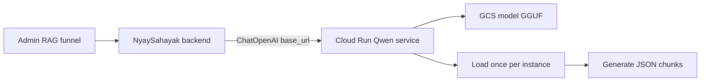

# Qwen2.5-3B Cloud Run Service (option 2)

## Constraints we are accepting

- **CPU only**, `minScale=0`, **request-based billing**
- Cold start will often take **1–5+ minutes** (GCS copy + model load into RAM)
- **Concurrency = 1** so one request owns the loaded model
- Memory **16Gi**, CPU **4–8**, request timeout **3600s**
- Not suitable for interactive chat; OK for admin RAG page-batch chunking if the backend timeout is raised for this provider

## Architecture

Separate from the main app Dockerfile ([Dockerfile](Dockerfile)). New small service under `deploy/qwen-cloudrun/`.

## Service design

**Runtime choice (CPU):** `llama-cpp-python` serving a **Q4_K_M GGUF** of `Qwen2.5-3B-Instruct` (same model family, fits Cloud Run RAM better than full BF16 transformers).

**API:** OpenAI-compatible `POST /v1/chat/completions` (+ `GET /healthz`) via FastAPI so existing `ChatOpenAI` in [backend/utils.py](backend/utils.py) can call it.

**Model packaging:** store GGUF in GCS (e.g. `gs://…/models/qwen2.5-3b-instruct-q4.gguf`). On container start:

1. If local path missing, `gsutil`/`google-cloud-storage` download to `/models/…`
2. Load into llama.cpp once (module-level singleton)
3. Serve requests until the instance scales to zero

**Auth:** shared bearer token (`SELFHOST_LLM_API_KEY`) required on the service; same key in backend env.

**Concurrency / lifecycle:** `WEB_CONCURRENCY=1`, Cloud Run `--concurrency=1`, `--cpu-boost` on startup if available. No model unload between requests on a warm instance.

## Backend integration

1. Add provider **`selfhost`** in:
   - [backend/utils.py](backend/utils.py) — `_build_selfhost_llm()` using `ChatOpenAI(base_url=SELFHOST_LLM_BASE_URL, api_key=…, timeout=600)`
   - [backend/services/admin_models.py](backend/services/admin_models.py) — include in `TEXT_MODEL_PROVIDERS`, catalog model `Qwen2.5-3B-Instruct`, `selfhost_configured` when URL+key set
2. [web_app/components/admin/AdminModelSelector.tsx](web_app/components/admin/AdminModelSelector.tsx) picks it up from catalog (no UI rewrite if catalog drives providers)
3. RAG funnel already calls `invoke_llm_with_selection` — no pipeline rewrite beyond timeout/retries for `selfhost`
4. Document in [docs/SCR_JUDGMENT_FETCHER.md](docs/SCR_JUDGMENT_FETCHER.md) or a short `docs/SELFHOST_LLM_CLOUD_RUN.md`: cold-start expectations, how to select provider in header

## Deploy artifacts

Under `deploy/qwen-cloudrun/`:

- `Dockerfile` — python slim + llama-cpp-python (CPU wheel) + FastAPI/uvicorn
- `app.py` — health + chat completions, lazy/global model load
- `requirements.txt`
- `cloudbuild.yaml` or shell script `deploy.sh` with `gcloud run deploy` flags:
  - `--min-instances=0 --max-instances=1`
  - `--cpu=4 --memory=16Gi`
  - `--concurrency=1 --timeout=3600`
  - `--cpu-throttling` / request-only CPU (default request billing)
  - env: `MODEL_GCS_URI`, `API_KEY`, `N_CTX` (~8192), `N_THREADS`

## Operational notes (documented, not optional fluff)

- First request after idle: expect long wait; backend timeout must be **≥600s** for `selfhost`
- SCR sequential PDF ingest will re-hit cold start if the service scales to zero between PDFs — keep `--max-instances=1` and optionally a later warm-ping (out of scope unless requested)
- If quality/speed is bad on CPU Q4, fallback remains header switch to Gemini/OpenRouter paid

## Out of scope

- GPU / L4
- Baking full BF16 weights into the image
- Cloud Run Jobs path (option 1)
- Changing SCR worker concurrency beyond existing single-PDF ingest
