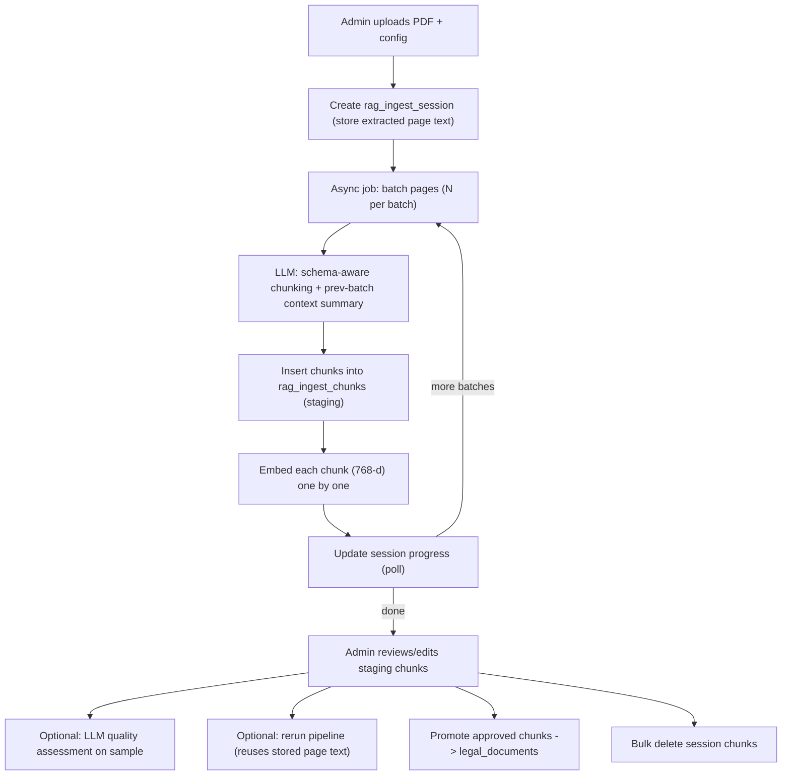

## RAG Funnel Admin Tab

Ingest legal PDFs into `legal_documents` via an LLM-driven chunking pipeline with a staging/review step.

### Architecture flow

### Design decisions (confirmed)
- Chunks land in a **staging table** (`rag_ingest_chunks`); admin reviews/edits, then promotes into `legal_documents`.
- Pipeline runs as an **async background job** with progress polling (mirrors existing `embedding_admin.start_async_regenerate` in-memory job registry).
- Source PDF Cloudinary upload is an **optional per-run toggle** (default off). Extracted page text is always stored on the session so **rerun works without re-upload**.

### 1. Database - new migration `backend/database/migrations/016_rag_funnel.sql`
- `rag_ingest_sessions`: `id uuid pk`, `created_at/updated_at`, `created_by text`, `document_name`, `act_name`, `source_filename`, `source_pdf_url text null` (Cloudinary), `source_pages jsonb` (array of extracted page texts, for rerun), `config jsonb` (pages_per_batch, chunk_target_length, quality_sample_count, provider, model), `status text` (pending/running/completed/failed/promoted), `total_pages int`, `processed_pages int`, `chunk_count int`, `promoted_count int`, `quality jsonb`, `error text`.
- `rag_ingest_chunks` (staging - mirrors `legal_documents` fields): `id uuid pk`, `session_id uuid` FK `ON DELETE CASCADE`, `seq int`, `page_start/page_end int`, `status text` (draft/embedded/approved/rejected/promoted), all content columns (`document_name, act_name, category, year_introduced, year_amendment, section_number, subsection_text, title, content, summary, authority, jurisdiction, legal_status, related_acts text[], keywords text[], severity_level, applicable_sections text[], punishments, source_url, source_type, pdf_page_reference, version, language`), `embedding vector(768) null`, `quality jsonb`, `promoted_document_id bigint null`, timestamps. Index on `session_id`.
- Seed `system_config` key `rag_funnel` (default provider/model + `pages_per_batch`, `chunk_target_length`, `quality_sample_count`) so defaults exist; per-run config overrides. Follows `009_ai_models_and_pgvector.sql` seed style. Apply via `python scripts/migrate_postgres.py` (local + VM, same flow used for 015).

### 2. Backend service - new `backend/services/rag_funnel.py`
- **PDF extraction**: reuse `_extract_pdf_pages()` logic from `scripts/ingest_legal_documents.py` (`pypdf`, already in `requirements.txt`).
- **Chunking**: for each page batch, build a system prompt embedding the `legal_documents` column schema + a `previous_context_summary` carried from the prior batch; call `invoke_llm_with_selection(provider, model, messages, task_id="rag_funnel.chunk")` from `backend/utils.py`; parse a JSON array (extend the `_extract_json_object` fence-stripping pattern from `backend/services/graph_payload_generator.py` to arrays).
- **Embed + store**: for each returned chunk, insert into `rag_ingest_chunks`, then embed via `embedding_admin._embed_texts([...])` + `embedding_admin.format_pgvector(...)`, `UPDATE ... embedding = %s::vector`. Update session progress after each batch and generate the next batch's context summary.
- **Async job registry**: threaded job with progress, mirroring `embedding_admin.start_async_regenerate` / `get_job`.
- `assess_quality(session_id, sample_count)`: send N staging chunks to the LLM, store report in `session.quality`.
- `rerun_session(session_id)`: delete existing staging chunks, re-run pipeline from stored `source_pages` (no re-upload).
- `promote_session(session_id)`: copy approved chunks (with embeddings) into `legal_documents`, set `promoted_document_id`, mark session `promoted`.
- `delete_session(session_id)`: cascade-deletes staging chunks; optional flag to also delete promoted `legal_documents` rows via `promoted_document_id`.

### 3. Backend routes - extend `backend/routes/admin_routes.py` (prefix `/api/admin`, `AdminUser = Depends(require_roles(...))`)
- `POST /rag/sessions` (multipart: PDF + config JSON) -> extract pages, optional Cloudinary upload via `CloudinaryService.upload_pdf`-style raw upload, create session, start async job.
- `GET /rag/sessions`, `GET /rag/sessions/{id}` (detail + progress for polling), `GET /rag/sessions/{id}/chunks` (paginated).
- `PATCH /rag/chunks/{id}` (edit fields / set approved|rejected), `POST /rag/sessions/{id}/rerun`, `POST /rag/sessions/{id}/quality`, `POST /rag/sessions/{id}/promote`, `DELETE /rag/sessions/{id}`.
- Reuse service-layer + `HTTPException` error pattern already used by `/embeddings/regenerate`.

### 4. Frontend
- `web_app/components/admin/admin-nav-config.ts`: add `"rag"` to `AdminTabId` union and nav item `{ id: "rag", label: "RAG funnel", icon: Filter, group: "AI" }`.
- `web_app/components/admin/AdminDashboard.tsx`: render `{tab === "rag" && <AdminRagFunnelPanel />}`.
- New `web_app/components/admin/AdminRagFunnelPanel.tsx` using `AdminWorkspace`: sidebar = session list (`AdminNavItem` with status/chunk-count meta); main = upload + config form (pages per batch, chunk target length, quality sample count, default doc metadata, Cloudinary toggle, model via existing `AdminModelSelector`), a running-progress view (poll `GET /rag/sessions/{id}` like `embeddingJobStatus`), a chunk review grid (edit title/keywords/fields, approve/reject), and action buttons (Rerun, Quality check, Promote, Delete). Reuse `AdminJsonEditorModal`/`AdminTextEditorModal` for array/long-text fields.
- `web_app/lib/adminApi.ts`: add `ragSessions`, `ragSession`, `createRagSession` (FormData, no JSON content-type - `adminFetch` already handles FormData), `ragChunks`, `updateRagChunk`, `rerunRagSession`, `ragQuality`, `promoteRagSession`, `deleteRagSession`.

### Notes
- Structured LLM output for all `legal_documents` fields is best-effort; the staging/review step is the safety net before anything touches `legal_documents`.
- Async job registry is in-memory/single-process (consistent with existing embeddings jobs) - fine for admin use; note if multi-worker deploy needs a DB-backed queue later.