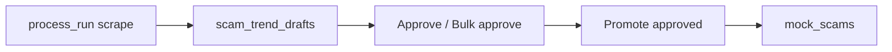

# Scam-trends staging + approval

## Why you see Stored 7/10 with Extracted 7

These use different denominators:

- **10** = `requested_count` (what you asked for)
- **7** = how many distinct trends the LLM/dedupe pipeline actually produced (`config.results.length`)
- **Stored 7** = all 7 of those were inserted into `mock_scams`

So nothing failed on insert — the model only returned 7 unique trends from 12 search hits (merge/dedupe prompts + in-batch `_dedupe_key`). After this change, the table will show **extracted / requested** and **promoted**, not “stored,” so this is less confusing.

## Target flow

Mirror the existing RAG funnel pattern in the same admin panel (`bulkApprove` then `Promote approved`).

## 1. Migration: `scam_trend_drafts`

Add [`backend/database/migrations/021_scam_trend_drafts.sql`](backend/database/migrations/021_scam_trend_drafts.sql):

- Columns: `id`, `run_id` → `scam_trend_runs`, `seq`, `status` (`draft|approved|rejected|promoted`), `title`, `description`, `scam_type`, `risk_level`, `city`, `embedding vector(768)`, `similar_to_existing` bool, `similarity_score`, `promoted_mock_scam_id`, timestamps
- Indexes on `(run_id, seq)` and `(run_id, status)`
- On `scam_trend_runs`: add `extracted_count`, `approved_count`, `promoted_count` (defaults 0)

## 2. Backend: stage instead of insert

In [`backend/services/scam_trends_scraper.py`](backend/services/scam_trends_scraper.py) `process_run`:

- Keep search → LLM extract → in-batch dedupe
- Similarity check vs `mock_scams` (~0.90) only **flags** `similar_to_existing` (still stage the row; do not auto-insert)
- Insert rows into `scam_trend_drafts` with embedding; set `status=draft`
- Update run: `extracted_count`, `stored_count=0` (legacy field unused for inserts), `config.results` kept in sync for drawer fallback, `message` like “Staged N drafts for approval”
- **Remove** `insert_mock_scam_with_embedding` from the scrape path

New helpers in postgres path (same pattern as RAG): list drafts by run; set status; bulk approve draft rows for a run; promote approved → call existing `insert_mock_scam_with_embedding`, set `promoted` + `promoted_mock_scam_id`, bump `promoted_count`.

## 3. Admin APIs

In [`backend/routes/admin_routes.py`](backend/routes/admin_routes.py) + [`web_app/lib/adminApi.ts`](web_app/lib/adminApi.ts):

| Endpoint | Behavior |
|---|---|
| `GET /api/admin/scam-trends/runs/{id}/drafts` | List drafts for drawer |
| `POST .../drafts/{draft_id}/status` | `{status: approved\|rejected\|draft}` |
| `POST .../runs/{id}/approve-all` | Bulk-approve all `draft` rows |
| `POST .../runs/{id}/promote` | Promote `approved` drafts into `mock_scams` |

Wire through thin functions on the scraper/service module (or a small `scam_trends_approval.py` if cleaner).

## 4. UI: ScamRunDrawer + table labels

In [`web_app/components/admin/AdminRagFunnelPanel.tsx`](web_app/components/admin/AdminRagFunnelPanel.tsx) (`ScamTrendsPanel` / `ScamRunDrawer`):

- Table column: **Extracted** `extracted_count/requested_count` (fallback `results.length`) instead of Stored `7/10`
- Drawer stats: Extracted · Approved · Promoted · Searched
- Per draft: status badge + Approve / Reject (disabled once `promoted`)
- Footer actions: **Approve all**, **Promote approved (N)** — same interaction pattern as RAG chunk review (~1854–1906)
- Warn badge when `similar_to_existing` (“near existing mock_scam”)

## 5. Ops note

Apply migration `021` on local Postgres (and Cloud SQL on next deploy). Existing runs that already wrote into `mock_scams` stay as-is; only **new** runs use drafts.